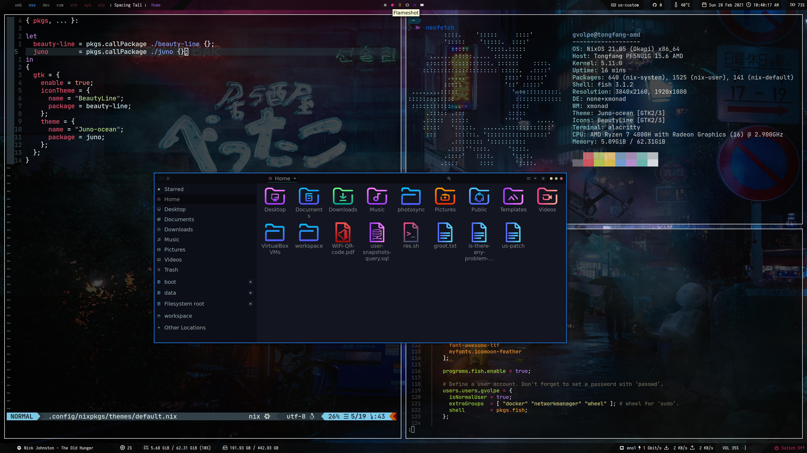

nix-config
==========

[](https://github.com/gvolpe/nix-config/actions)
[](https://github.com/gvolpe/nix-config/actions)

My current — and always evolving — NixOS configuration files, home-manager, neovim, etc.




## Programs

The `home.nix` file contains details about all the software I use, but here's a shout-out to the ones I use the most and that are customized to my needs.

| Type           | Program      |
| :------------- | :----------: |
| Editor         | [NeoVim](https://neovim.io/) |
| Launcher       | [Rofi](https://github.com/davatorium/rofi) |
| Shell          | [Fish](https://fishshell.com/) |
| Status Bar     | [Polybar](https://polybar.github.io/) |
| Terminal       | [Alacritty](https://github.com/alacritty/alacritty) |
| Window Manager | [XMonad](https://xmonad.org/) |

If you're interested in using `taffybar` or `xmobar`, browse the commit history and you will find the configuration files I used. Here's a [screenshot](imgs/taffybar.png) showcasing the former.

## Themes

| Type           | Name      |
| :------------- | :----------: |
| GTK Theme      | [Juno Ocean](https://github.com/EliverLara/Juno) |
| GTK Icon Theme | [Beauty Line](https://www.gnome-look.org/p/1425426/) |
| Terminal Font  | [JetBrainsMono](https://www.jetbrains.com/lp/mono/) |

## Structure

Here is an overview of the folders' structure:

```
.
├── build.sh
├── default.nix
├── home
│  ├── config.nix
│  ├── default.nix
│  ├── display
│  ├── home.nix
│  ├── overlays
│  ├── pinned
│  ├── programs
│  ├── scripts
│  ├── secrets
│  ├── services
│  └── themes
├── imgs
├── notes
├── pinned
│  ├── home-manager
│  └── nixpkgs
└── system
   ├── cachix
   ├── cachix.nix
   ├── configuration.nix
   ├── flake.nix
   ├── flake.lock
   ├── fonts
   ├── machine
   ├── misc
   └── wm
```

- `build.sh`: the build and installation script.
- `default.nix`: derivation for home, used in CI.
- `flake.nix`: flake for system (home not migrated yet).
- `home`: all the user programs, services and dotfiles.
- `imgs`: screenshots and other images.
- `notes`: cheat-sheets, docs, etc.
- `system`: the NixOS configuration, settings for different laptops and window managers.

## Install

On a fresh NixOS installation, run the following commands:

```shell
mkdir DELETE_ME && cd DELETE_ME
nix-shell --run \
  "wget -c https://github.com/gvolpe/nix-config/archive/master.tar.gz && tar --strip-components=1 -xvf master.tar.gz" \
  -p wget s-tar
chmod +x build.sh && ./build.sh
```
