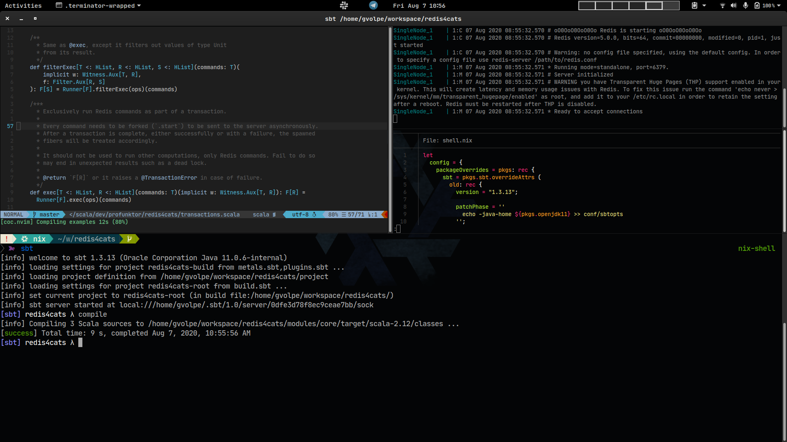
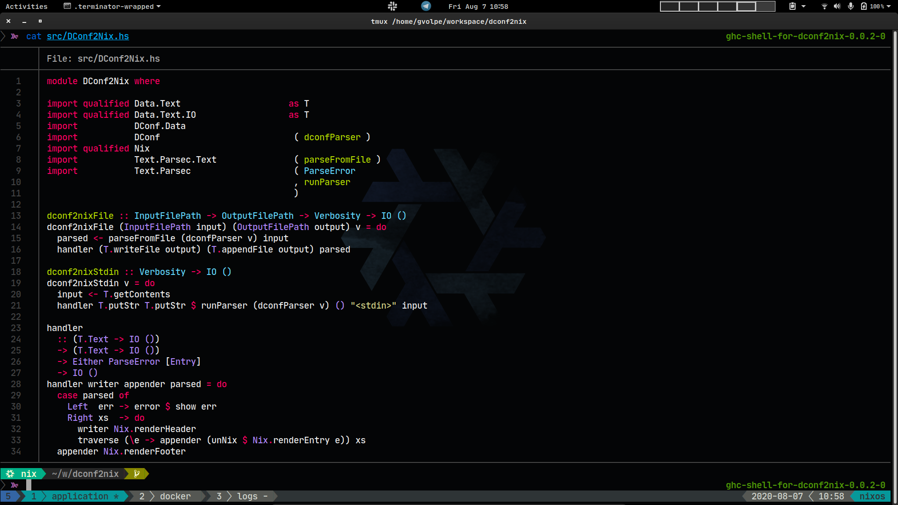

nix-config
==========

My current - and always evolving - NixOS configuration files, home-manager, neovim, etc.

### Structure

Here is an overview of the folders' structure:

```
├── home
│   ├── home.nix
│   ├── overlays
│   └── programs
├── imgs
├── install.sh
├── misc
├── scripts
└── system
    ├── configuration.nix
    └── machine
```

- `home`: all the user programs and dotfiles.
- `imgs`: screenshots and other images.
- `install.sh`: the install script.
- `misc`: cheat-sheets, docs and useful commands.
- `scripts`: a few scripts I find useful.
- `system`: the NixOS configuration, including settings for different laptops.

### Programs

The `home.nix` file contains details about all the software I use but here's a shout-out to the ones that are customized to my needs.

#### Fish Shell

I use a customized version of [bobthefish theme](https://github.com/oh-my-fish/theme-bobthefish). Here's a screenshot:


#### Gnome3

My desktop manager of choice, including a few extensions like `dash-to-dock`, `clipboard-indicator` and `sound-output-device-chooser`.


#### NeoVim

My favorite text editor and IDE powered by LSP (language server protocol). I use too many plugins to name so here's a screenshot taken while editing this file:


#### Terminator

A great terminal multiplexer, easy to use.



#### Tmux

Another terminal multiplexer, also capable of keep SSH sessions alive.



### Install

On a fresh NixOS installation, run the following commands:

```shell
mkdir DELETE_ME && cd DELETE_ME
nix-shell --run \
  "wget -c https://github.com/gvolpe/nix-config/archive/master.tar.gz && tar --strip-components=1 -xvf master.tar.gz" \
  -p wget s-tar
chmod +x install.sh && ./install.sh
```
